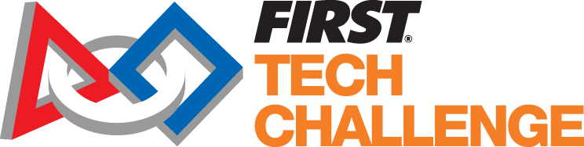

# **Hello!**
This is a the team website of the FIRST® Tech Challenge (FTC)
# **Our Code:**
Homepage:
```html
<!DOCTYPE html>
<html lang="en">
<head>
<meta charset="UTF-8">
<meta name="viewport" content="width=device-width, initial-scale=1.0">
<title>Surf Robotics | FTC Team</title>
<link rel="icon" type="image/x-icon" href="templogo.png">
<link rel="stylesheet" href="style.css">
<link href="https://fonts.googleapis.com/css2?family=Bebas+Neue&family=DM+Sans:ital,wght@0,300;0,400;0,500;0,700;1,300&family=Space+Mono:wght@400;700&display=swap" rel="stylesheet">
</head>
<body class="page-home"

<!-- NAV -->
<nav class="nav">
  <a href="index.html" class="nav-logo">
    <span class="logo-wave">~</span> SURF ROBOTICS
  </a>
  <button class="nav-toggle" id="navToggle" aria-label="Toggle menu">
    <span></span><span></span><span></span>
  </button>
  <ul class="nav-links" id="navLinks">
    <li><a href="index.html" class="active">Home</a></li>
    <li><a href="about.html">About Us</a></li>
    <li><a href="season.html">2026–27 Season</a></li>
    <li><a href="outreach.html">Outreach & Sponsors</a></li>
    <li><a href="blog.html">Blog</a></li>
  </ul>
</nav>

<!-- HERO -->
<header class="hero">
  <div class="hero-bg">
    <div class="wave wave1"></div>
    <div class="wave wave2"></div>
    <div class="wave wave3"></div>
  </div>
  <div class="hero-content">
    <p class="hero-eyebrow">FIRST® Tech Challenge Robotics Team (Team Number TBD)</p>
    <h1 class="hero-title">SURF<br>ROBOTICS</h1>
    <p class="hero-sub">Riding the wave of innovation — one match at a time.</p>
    <div class="hero-actions">
      <a href="season.html" class="btn btn-primary">2026–27 Season</a>
      <a href="about.html" class="btn btn-ghost">Meet the Team</a>
    </div>
  </div>
  <div class="hero-scroll">SCROLL DOWN</div>
</header>

<!-- STATS BAR -->
<section class="stats-bar">
  <div class="stat"><span class="stat-num">0</span><span class="stat-label">Seasons</span></div>
  <div class="stat-divider"></div>
  <div class="stat"><span class="stat-num">6</span><span class="stat-label">Team Members</span></div>
  <div class="stat-divider"></div>
  <div class="stat"><span class="stat-num">0</span><span class="stat-label">Awards</span></div>
  <div class="stat-divider"></div>
  <div class="stat"><span class="stat-num">0</span><span class="stat-label">Outreach Hours</span></div>
</section>

<!-- HIGHLIGHTS -->
<section class="section highlights">
  <div class="container">
    <p class="section-eyebrow">What We Do</p>
    <h2 class="section-title">Engineering.<br>Innovation.<br>Community.</h2>
    <div class="cards-grid">
      <div class="card card-teal">
        <div class="card-icon">🛠️</div>
        <h3>Build</h3>
        <p>We design and fabricate competitive robots using Onshape CAD and hands-on fabrication.</p>
      </div>
      <div class="card card-sand">
        <div class="card-icon">💻</div>
        <h3>Code</h3>
        <p>Our software team will write autonomous routines and driver-assist systems in Block using FTC SDK and computer vision.</p>
      </div>
    </div>
  </div>
</section>

<!-- SEASON TEASER -->
<section class="section season-teaser">
  <div class="container season-teaser-inner">
    <div class="season-teaser-text">
      <p class="section-eyebrow">Current Season</p>
      <h2 class="section-title">2026–2027</h2>
      <p>We're planning on attending the latest season. Meanwhile, we are perfecting our craft and preparing for upcoming events.</p>
      <a href="season.html" class="btn btn-primary">See the Season →</a>
    </div>
    <div class="season-teaser-visual">
      <div class="robot-placeholder">
        <div class="robot-body">
          <div class="robot-head"></div>
          <div class="robot-chassis"></div>
          <div class="robot-wheel wl"></div>
          <div class="robot-wheel wr"></div>
        </div>
        <p class="robot-caption">SURF BOT MK IV</p>
      </div>
    </div>
  </div>
</section>

<!-- LATEST BLOG -->
<section class="section blog-teaser">
  <div class="container">
    <div class="blog-teaser-header">
      <div>
        <p class="section-eyebrow">Latest Updates</p>
        <h2 class="section-title-sm">From the Blog</h2>
      </div>
      <a href="blog.html" class="btn btn-ghost">All Posts →</a>
    </div>
    <div class="blog-preview-grid">
      <a href="blog.html" class="blog-preview-card">
        <span class="blog-tag">Build Season</span>
        <h4>Building The Starter Bot</h4>
        <p>We built the starter bot for the preious season to familiarize ourselves with the components.</p>
        <span class="blog-date">May 2, 2026</span>
      </a>
      <a href="blog.html" class="blog-preview-card">
        <span class="blog-tag">New Name</span>
        <h4>We decided on a name and kickstarted our operatiions.</h4>
        <p>Meet team SURF. Built from innovation, courage and creativity.</p>
        <span class="blog-date">May 2, 2026</span>
      </a>
      <a href="blog.html" class="blog-preview-card">
        <span class="blog-tag">Meetings</span>
        <h4>Our First Meeting</h4>
        <p>We met up for the first time offically.</p>
        <span class="blog-date">April 27, 2026</span>
      </a>
    </div>
  </div>
</section>

<!-- FOOTER -->
<footer class="footer">
  <div class="container footer-inner">
    <div class="footer-brand">
      <span class="logo-wave">~</span> SURF ROBOTICS
      <p>FTC Team · Northern California</p>
    </div>
    <nav class="footer-nav">
      <a href="about.html">About</a>
      <a href="season.html">Season</a>
      <a href="outreach.html">Outreach</a>
      <a href="blog.html">Blog</a>
    </nav>
    
    <p class="footer-copy">© 2026 Surf Robotics The FIRST® Tech Challenge Logo is a trademark of FIRST®</p>
  </div>
</footer>

<script src="main.js"></script>
</body>
</html>
```
*(this code is intentionally changed so you can't just copy it.;)
Main.js:
```js
